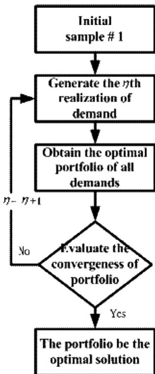
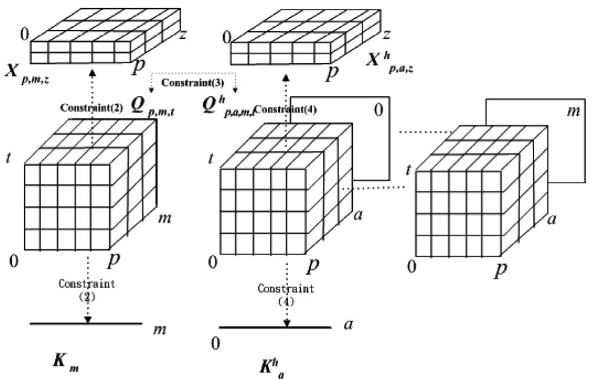
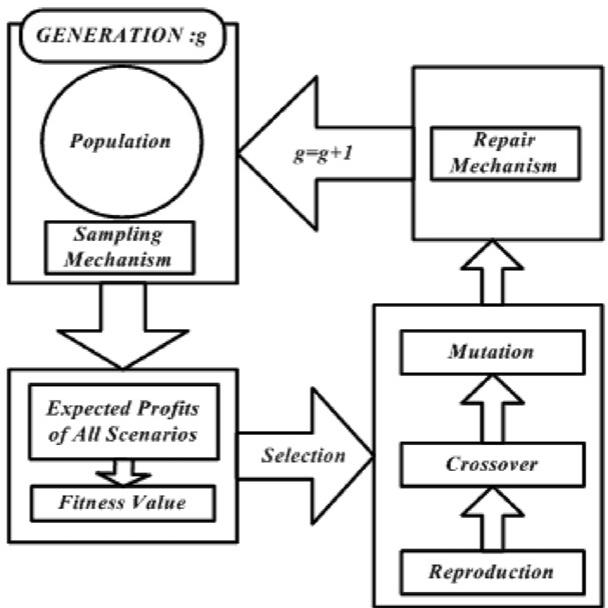
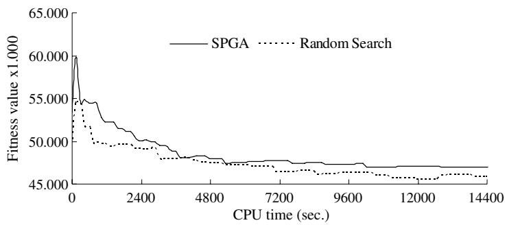
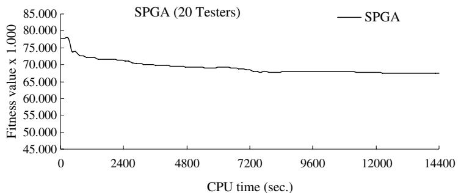
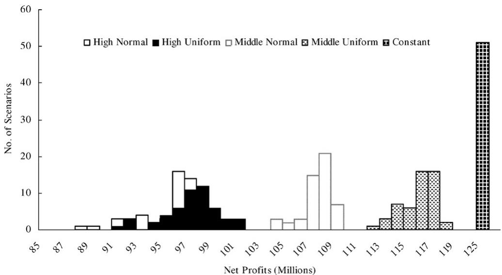

# O.R. Applications

## A resource portfolio planning model using sampling-based stochastic programming and genetic algorithm

K.-J. Wang a,1, S.-M. Wang b,\*, J.-C. Chen b,2

\(^{a}\)  Department of Industrial Management, National Taiwan University of Science and Technology, #43, Sec. 4, Keelung Road, Taipei 106, Taiwan, ROC

\(^{b}\)  Department of Industrial Engineering, Chung-Yuan Christian University, #200, Chung Pei Road, Chung Li, 320, Taiwan, ROC

Received 5 October 2005; accepted 4 October 2006

Available online 20 December 2006

### Abstract

Resource portfolio planning optimization is crucial to high-tech manufacturing industries. One of the most important characteristics of such a problem is intensive investment and risk in demands. In this study, a nonlinear stochastic optimization model is developed to maximize the expected profit under demand uncertainty. For solution efficiency, a stochastic programming-based genetic algorithm (SPGA) is proposed to determine a profitable capacity planning and task allocation plan. The algorithm improves a conventional two-stage stochastic programming by integrating a genetic algorithm into a stochastic sampling procedure to solve this large-scale nonlinear stochastic optimization on a real-time basis. Finally, the tradeoff between profits and risks is evaluated under different settings of algorithmic and hedging parameters. Experimental results have shown that the proposed algorithm can solve the problem efficiently.

© 2006 Elsevier B.V. All rights reserved.

Keywords: Capacity planning and allocation; Stochastic programming; Genetic algorithms

# 1. Introduction

Stochastic resource planning and capacity allocation deals with the problem of how to find an optimal resource portfolio under uncertain demands. Such a portfolio planning has been explored in high-tech manufacturing industries due to intensive

capital and technology involvement as well as risky market demands and short product/equipment life cycle (Neslihan, 2002). The industries not only face a variety of orders containing make-to-order and make-to-stock, but also seek to maximize profit while minimizing risk. Some other significant factors in the industries, such as constrained resource capability, simultaneous resources settings, optional alternatives of resource acquisition, and different operational strategies must be incorporated but dealt with separately for simplification. In terms of stochastic demands, most of the related studies only deal with it using the scenario optimization technique; but it cannot precisely reflect the situations

of continuous distribution in real demands and many possible scenarios.

In high-tech industries, it is difficult for a company to set up an appropriate long-term capacity level under uncertainty. Such a uncertainty may arise as a consequence of a breakthrough technology, opening of new markets or innovative products, or dramatic economic changes with bullwhip effect. The most important characteristic within this resource optimization problem is the risk of investments on expensive resources. As a result, production deciders have to keep in view and struggle constantly against the uncertainty in demand size and strategies of competitors in lumpy environment, along with high capital expenditure or lack of capacity for demand variants.

The purpose of this paper is to develop both a precise mathematical representation and the corresponding solving algorithm to maximize the expected profit under demand uncertainty. The following decisions are examined in this study.

(i) The optimal resource portfolio plan (including the type and amount of resources that must be procured, rented, transferred and/or sold-out) accounting for the time value of capital.  
(ii) The choice of the most profitable orders from pending orders.  
(iii) The optimal allocation of tasks that specifies the optimal quantity of products produced in each time bucket.

The rest of this article is organized as follows. Section 2 reviews related research into capacity planning and allocation, and uncertainty modeling and solution methodology. Section 3 presents a nonlinear mixed integer mathematical model for the resource portfolio planning problem. In section 4, a stochastic programming based genetic algorithm (SPGA) is proposed to solve the problem. Section 5 compares the proposed algorithm with a random-search algorithm as a benchmark, and presents the results of sensitivity analysis under different model parameters settings. Finally, Section 6 draws conclusions.

## 2. Related works

Solving approaches of resource planning and capacity allocation can be roughly divided into two categories: mathematical programming and soft-computing methods. Linear programming

(LP) and mixed integer linear programming (MILP), as typical forms of the exact methods are usually used to model material planning and capacity allocation problems, respectively (e.g., Rajagopalan, 1994; Hung and Leachman, 1996; Bashyam, 1996; Hung and Wang, 1997 to name a few). The mathematical-based modeling and exact solution methods are accurate but usually suffer from time-consuming due to the complexity of problems. Although the resource portfolio planning and task allocation planning are strongly related, most of the literatures using the exact methods have solved these problems separately for simplification.

To design a proper solution method for the addressed problem, one must consider the tradeoff between solution efficiency and quality. Soft computing methods have rapidly emerged to attack the capacity allocation and expansion problem (For instance, Bard et al., 1999; Swaminathan, 2000 and Merkle et al., 2002). Among the methods, genetic algorithm (GA) is the most popular one had been employed in solving resource planning problem, as compared with simulated annealing and tabu search. Holland (1975) first proposed a simple GA. Certain concerns exist regarding when a GA methodology should be used, including the representation of a chromosome structure, initial population, population size, selection probabilities, genetic operators, and termination conditions. A fitness function is then used to screen for good chromosomes. The survey of a GA can be found in numerous studies (e.g., David, 1953; Mitsuo and Runwei, 2000). Li et al. (1998) presented a GA approach to solve a problem with multiple-periods and multiple-levels capacity balancing issues. Tiwari and Vidyarth (2000) employed a GA to allocate capacity for orders and increased resource utilization and throughput. Ip et al. (2000) developed a model to address the planning and scheduling problem in a multiple-products manufacturing environment by applying GA. Wang and Lin (2002) addressed a capacity expansion and allocation problem for a high-tech manufacturing with a constrained budget using GA. Wang and Hou (2003) also solved the problem of capacity expansion and allocation in the semiconductor testing industry using GA. Pongcharoen et al. (2004) proposed a GA based scheduling tool that token into account multiple-resources constraints and multiple-levels of product structure.

The above literatures are only valid for a deterministic-demand assumption which is impractical to some extent in industry facing a stochastic

demand. Conventionally, a stochastic optimization problem is modeled and implemented by either a sampling-based or a scenario-based approach for stochastic demands. Recent studies regarding scenario-based optimization for resource portfolio are described as follows. Alonso et al. (2000) presented a model for the air traffic management problem under uncertainty in airport arrival and departure as well as airspace capacity. Chen et al. (2002) considered a Lagrangian model of technology and capacity planning characterized by multiple products, stochastic demands and technology alternatives problem. Barut and Sridharan (2004) developed a heuristic for short-term constrained capacity allocation to multiple products in maketo-order manufacturing with three different scenarios of order rate of products. Higgins and David (2005) applied a simulation model for capacity planning. For a given scenario for cost reductions in harvesting and transport, the model measures the impacts of locomotive shifts, bin requirements, and the time that harvesters spend waiting for bin.

However, when potential scenarios are numerous or of continuous distributions, a scenarios-based stochastic programming has lower precision than a sampling-based one. Furthermore, the sampling-based approach can conduct planning dynamically on the basis of updated information. The two-stage stochastic program mentioned originally by Higle and Sen (1996) has been proven to represent effectively a stochastic model with randomness in sampling. The decomposition procedure applied in the two-stage program approximates the expected risk generated by cutting planes where each cutting plane is obtained by a demand realization (Chang et al., 2002). Several scholars have applied the two-stage program to capacity planning. Lee (2002) developed an artificial intelligence-based sampling system in semiconductor manufacturing industry for reduction and improvement in operational efficiency. Gritsevskyi and Nakićenović (2000) presented a new method for modeling-induced technological learning and uncertainty in energy system.

Regarding the two-stage sampling-based stochastic program, conceptually, the optimal resource portfolio solution under first  \(\varsigma\)  demands (sample sets) will review whether  \(\varsigma + 1\) th cutting plan is necessary through sampling for the next estimate. It can be shown that as  \(\varsigma \to \infty\) , the portfolio will converge to the optimal solution. The original decomposition procedure of the two-stage sampling-based stochas

tic program is shown in Fig. 1. With respect to tradeoff between the risk and profit, several scholars have proposed mean absolute deviation methods to represent the possible risk on the different application domains (e.g., as Xia et al., 2000; Xia et al., 2001; Chang et al., 2000; Ehrgott et al., 2004). It is worthy to note that much computational effort is needed for the two-stage sampling-based stochastic program.

In summary, resource portfolio planning and task allocation are strongly related, but academic studies have solved these problems separately for simplification. Some significant factors that affect the decision-making on resource planning and allocation in high-tech industries, such as operational strategies, make-to-stock versus make-to-order policy, time value of capital, salvaging and depreciation of resources, and demand dynamics, have been neglected. Decisions regarding resource acquisition and phase-out alternatives have also been simplified. Moreover, evaluation criteria considering stochastic demands and hedging from demand variation are needed. Thus, a more generalized mathematical model is required to describe precisely the problem facing the industries in view of the

  
Fig. 1. Basic steps of two-stage sampling based stochastic program.

above factors. Furthermore, although soft-computing-based methods can attack with the resource allocation and expansion problem more efficiently, much computational effort has been wasted due to poor algorithm design. Opportunities still exist for improving the performances of algorithms and accelerating their computational speed.

### 3. Problem formulation

Resource portfolio planning herein considers the variance of different demands and expected return in long-term planning horizon. A decision-maker must adjust the level of resources through alternatives such as renting and transferring by outsourcing. In the high-tech industry, products are often measured by the corresponding resource capacity required to calibrate (Wang and Hou, 2003). Both make-to-stock and make-to-order types of production are considered in the model. The former needs to be completely fulfilled in the span of production horizon, while the latter are done selectively. Furthermore, owing to its potential profitability, capital can be easily gathered from the monetary market. Residual capital/assets in earlier periods, which is regarded as liquidity, can be used in subsequent planning periods.

Several assumptions are presented and justified as follows.

- Demands are presented as a set in which each demand consists of several types of products. This occurs in many industries; for instance, an order in semiconductor manufacturing and testing industry may consist of several "devices"; an order in TFT-LCD manufacturing industry may comprise different sizes of slides. Moreover, the each demand was presented in a discrete-time base. Usually, orders are placed in each week or month.  
- Resource procurement occurs only in the initial period, whereas resource capacity can be adjusted in the intermediate periods through renting or transferring from other plants. Depreciation of resources is reflected in salvage price that can be estimated. This assumption conforms to the situation in many high-tech industries in which the duration of an investment cycle ranges from 4 to 8 quarters. The equipment procurement order is released (or planned) in the beginning of the cycle, and capacity can be adjusted through other alternatives such as renting and transferring from

other plants. Besides, the assumption states that the salvage price of resources can be estimated beforehand. A firm's accounting system can easily achieve such estimation.

- The target utilization and throughput rate of resource for individual products are known. These data are recorded regularly in and can be easily obtained by the historical database.  
- There are finite resource configurations to confine the technological feasibility for producing a product. In practice, a resource can only process certain products. Furthermore, an auxiliary resource can only work with a specified main resource and a product can thus only be performed by certain feasible resource configurations.

All the notations of the model are listed in the following:

- Index

MTO Index of demand pattern (make-to-order)  
MTS Index of demand pattern (make-to-stock)  
 \(\varsigma\)  Index of demand scenario  \((\varsigma = 1, \ldots)\) \(\lambda\)  Adjustable factor applied to tradeoff between profit and risk  \((0 \leqslant \lambda \leqslant 1)\) . When  \(\lambda = 0\) , the decision maker prefers the highest profits without considering the risk of investment. Conversely, when  \(\lambda = 1\) , the investor is very conscious of the risk of investment  
 \(a\)  Index of auxiliary resource type  \((a = 1, \ldots, A)\) \(h\)  Index of auxiliary resource category (such as operators and programs)  
 \(p\)  Index of production planning period  \((p = 1, \ldots, P)\) \(m\)  Index of main resource type  \((m = 1, \ldots, M)\) \(t\)  Index of product type  \((t = 1, \ldots, T)\) \(z\)  Index of resource outsourcing alternatives  \((z = 1, \ldots, Z)\)  (e.g., by rent, by transfer, etc.)

- Parameters

\(b_{p,t}\)  Unit profits of a product  \(t\)  produced in period  \(\pmb{p}\) ,  \(t\in T_m\) .  \(T_{m}\)  is the set of products produced in period  \(\pmb{p}\)  
\(c_{m,t}\)  Product-resource capabilities for product  \(t\)  associated with main resource type  \(\pmb{m}\) . This is a 0-1 parameter.  \(c_{m,t} = 1\)  if main resource type  \(\pmb{m}\)  can conduct product  \(t\) ;  \(c_{m,t} = 0\)  otherwise

\(c_{m,a,t}^{h}\)  Resource configuration capabilities for product  \(\pmb{t}\)  regarded with main resource type  \(\pmb{m}\)  and auxiliary resource type  \(\pmb{a}\)  (of the  \(h\)  category). This is a 0-1 parameter.  \(t\in T_m^h\) \(T_{m}^{h}\)  is a set of products that can be produced by auxiliary resource type  \(\pmb{a}\)  (of the  \(h\)  category) associated with main resource type  \(\pmb{m}\) \(a\in A_m^h\) \(A_{m}^{h}\)  is a set of auxiliary resource categories  \(\pmb{h}\)  associated with the main resource type  \(\pmb{m}\) \(c_{m,a,t}^{h} = 1\)  if auxiliary resource type  \(\pmb{a}\)  (of the  \(h\)  category) can conduct product  \(\pmb{t}\) ,  \(c_{m,a,t}^{h} = 0\)  otherwise  
\(d_{m}\)  Unit salvage value of phasing out a main resource type  \(m\) .  \(d_{m}\)  can be a positive or negative value  
\(d_{a}^{h}\)  Unit salvage value of phasing out an auxiliary resource type  \(\pmb{a}\)  (of the  \(h\)  category)  \(d_{a}^{h}\)  can be a positive or negative value  
\(e_{m}\)  Unit cost of purchasing a main resource type  \(m\)  
\(e_{a}^{h}\)  Unit cost of purchasing an auxiliary resource type  \(\pmb{a}\)  (of the  \(h\)  category)  
\(I_{p}\)  Capital interest rate in period  \(\pmb{p}\)  
The unit excess production cost of product  \(t\)  in period  \(p\)  
\(K_{0,a}^{h}\)  Number of auxiliary resource type  \(\pmb{a}\)  (of the  \(h\)  category) in the initial period  
\(K_{0,m}\)  Number of main resource type  \(m\)  in the initial period  
\(l_{p,t}\)  The unit lack production cost of product  \(t\)  in period  \(\pmb{p}\)  
\(o_{p,t}^{\zeta}\)  Market demands for product  \(t\)  in period  \(\pmb{p}\)  in scenario  \(\zeta\)  
\(r_{m,t}\)  Theoretical throughput of product  \(t\)  conducted by main resource type  \(\pmb{m}\)  
\(r_{m,a,t}^{h}\)  Theoretical throughput of product  \(t\)  conducted by auxiliary resource type  \(\pmb{a}\)  (of the  \(\pmb{h}\)  category), associated with main resource type  \(\pmb{m}\)  
\(u_{p,m,z}\)  Unit cost of main resource type  \(m\)  obtained by outsourcing alternative  \(z\)  in period  \(p\)  
\(u_{p,a,z}^{h}\)  Unit cost of auxiliary resource type  \(a\)  (of the  \(h\)  category) obtained by outsourcing alternative  \(z\)  in period  \(p\)  
\(w_{p,m}\)  Working hours of main resource type  \(m\)  in period  \(\pmb{p}\)  
\(w_{p,a}^{h}\)  Working hours of auxiliary resource type  \(\pmb{a}\)  (of the  \(h\)  category) in period  \(\pmb{p}\)  
\(y_{p,m}\)  Target utilization of main resource type  \(\pmb{m}\)  in period  \(p\)

\(y_{p,a}^{h}\)  Target utilization of auxiliary resource type  \(\pmb{a}\)  (of the  \(h\)  category) in period  \(\pmb{p}\)

#### - Decision variables

\(\theta^{\varsigma}\)  Profit gained in scenario  \(\varsigma\)  
\(F_{p}^{\varsigma}\)  Capital in the end of period  \(\pmb{p}\)  in scenario  \(\varsigma\) \(F_{p}^{\varsigma}\in R^{+}\)  
\(K_{m}\)  Number of in-house main resource type  \(\pmb{m}\)  in period  \(p\) .  \(K_{m} \in Z^{+}\)  
\(K_{a}^{h}\)  Number of in-house auxiliary resource type  \(\pmb{a}\)  (of the  \(h\)  category) in period  \(\pmb{p}\) .  \(K_{p,a}^{h} \in Z^{+}\)  
\(X_{p,m,z}\)  Number of main resource type  \(m\)  associated with resource acquisition alternative  \(z\)  in period  \(\pmb{p}\) .  \(X_{p,m,z} \in Z^{+}\)  
\(X_{p,a,z}^{h}\)  Number of auxiliary resource type  \(\mathbf{a}\)  (of the  \(h\)  category), associated with resource acquisition alternative  \(\mathbf{z}\)  in period  \(\mathbf{p}\) .  \(X_{p,a,z}^{h} \in Z^{+}\)  
\(Q_{p,m,t}\)  Quantity of product  \(\pmb{t}\)  produced by main resource type  \(\pmb{m}\)  in period  \(\pmb{p}\) .  \(Q_{p,m,t} \in R^{+}\)  
\(Q_{p,a,m,t}^{h}\)  Quantity of product  \(\pmb{t}\)  produced by auxiliary resource type  \(\pmb{a}\)  (of the  \(h\)  category), associated with main resource type  \(\pmb{m}\)  in period  \(\pmb{p}\) .  \(Q_{p,a,m,t}^{h} \in R^{+}\)  
\(S_{p,t}^{\varsigma}\)  Capacity loading quantity of product  \(t\)  in the end of period  \(\pmb{p}\)  in scenario  \(\varsigma\) .  \(S_{p,t} \in Z\)  
\(V_{p,t}^{\zeta}\)  The capacity loading cost of product  \(t\)  in period  \(\pmb{p}\)  in scenario  \(\varsigma\) .  \(V_{p,t}^{\zeta} \in R\)

The objective of the optimal simultaneous planning decision for level of capacity is to maximize the net profit in long-term periods and can be expressed formally as follows:

\[
\text {M a x}: (1 - \lambda) \sum_ {\zeta} \left(\frac {\theta^ {\zeta}}{\eta}\right) - \lambda \left(\frac {\sum_ {\zeta} \left| \theta^ {\zeta} - \overline {{\theta^ {\zeta}}} \right|}{\eta}\right), \tag {1}
\]

where  \(\lambda\)  is the tradeoff parameter of risk. We can see the tradeoff between the expected profits  \(\sum_{\varsigma}\left(\frac{\theta^{\varsigma}}{\eta}\right)\)  in all realized demands and its risk that is modeled as the mean absolute deviation (MAD) of profits in Eq. (1).

All constraints included in this model are presented as follows.

Required numbers of main resources. The number of existing main resources must be equal or larger than the allocated capacity (in machine quantity) to fulfill the orders promised:

\[
K _ {m} + \sum_ {z} X _ {p, m, z} \geqslant \sum_ {t} \frac {c _ {m , t} Q _ {p , m , t}}{r _ {m , t} w _ {p , m} y _ {p , m}}, \quad \forall p, m. \tag {2}
\]

Configuration constraints of main resources and auxiliary resources. Main resource type  \(m\)  must be associated with auxiliary resource type  \(a\)  (of the  \(h\)  category) to conduct promised product type  \(t\) . Hence, the quantities of products produced using main resources type  \(m\)  must be equal to the quantities of products handled by auxiliary resource type  \(a\)  (of the  \(h\)  category):

\[
\sum_ {a} c _ {m, a, t} ^ {h} Q _ {p, a, m, t} ^ {h} = Q _ {p, m, t}, \quad \forall p, m, h, t. \tag {3}
\]

Required numbers of auxiliary resources. The existing quantity of auxiliary resource type  \(\pmb{a}\)  (of the  \(\pmb{h}\)  category) in period  \(\pmb{p}\)  must be greater than or equal to the quantity to fulfill the orders promised:

\[
K _ {a} ^ {h} + \sum_ {z} X _ {p, a, z} ^ {h} \geqslant \sum_ {m, t} \frac {c _ {m , a , l} ^ {h} Q _ {p , a , m , t} ^ {h}}{r _ {m , a} ^ {h} w _ {p , a} ^ {h} v _ {p , a} ^ {h}}, \quad \forall p, a, h. \tag {4}
\]

Inventory balance from net market demands. In the demand scenario  \(\varsigma\) , net inventory level of make-to-stock order in period  \(p\)  is calculated from the net inventory level in period  \(p - 1\) , plus the net production in period  \(p\) , and minus the market demand in period  \(p\) . It is reasonable that different demand scenarios will occur different inventory level:

\[
S _ {p, t} ^ {\varsigma} = S _ {p - 1, t} ^ {\varsigma} + \sum_ {m \in M} c _ {m, t} Q _ {p, m, t} - o _ {p, t} ^ {\varsigma}, \quad t \in M T S, \quad \forall p, \varsigma , \tag {5}
\]

where  \(S_{p,t}^{\varsigma}\)  is the change in net inventory due to the realization of demand in product type  \(\pmb{t}\)  from period  \(\pmb{p} - 1\)  to period  \(\pmb{p}\) .

Production balance from net market demands. In make-to-order case, the market demand must be fulfilled on time. Backorder or inventory is not allowed in such order type. The production quantity in period  \(p\)  must less than or equal to the demand in period  \(p\) :

\[
\sum_ {m \in M} c _ {m, t} Q _ {p, m, t} \leqslant o _ {p, t} ^ {\zeta}, \quad t \in M T O, \quad \forall p, \tag {6}
\]

where  \(Q_{p,m,t}\)  is the net production due to the realization of demand in product type  \(t\)  in period  \(p\) .

Cost due to exceed or lack of capacities. Different inventory level in different scenario  \(\varsigma\)  also reflects different inventory cost. In here, each scenario has its different inventory cost due to different market demand:

\[
V _ {p, t} ^ {\zeta} = \left\{ \begin{array}{l l} j _ {p, t} S _ {p, t} ^ {\zeta}, & V _ {p, t} ^ {\zeta} \geqslant 0, \\ l _ {p, t} \left| S _ {p, t} ^ {\zeta} \right|, & \text {o t h e r w i s e ,} \end{array} \quad t \in M T S, \quad \forall p, \varsigma , \right. \tag {7}
\]

where  \(V_{p,t}^{\varsigma}\)  is the holding/backorder cost of products due to the gap between the production and the realized demand from period  \(\pmb{p} - 1\)  to period  \(\pmb{p}\) .  \(V_{p,t}^{\varsigma} \in Z\) .

Capital balance equation. The capital in period  \(p\)  is computed by adding the remaining budget (the first term in the right-hand side of (8)), the incomes of production profit (the last two terms in the right-hand side of (8)), and minus the outsourcing cost of main/auxiliary resources (the second and third terms of (8)), inventory cost (the fourth terms in the right-hand side of the following equation):

\[
\begin{array}{l} F _ {p} ^ {\varsigma} = F _ {p - 1} ^ {\varsigma} \left(1 + I _ {p}\right) - \sum_ {m \in M, z \in Z} \left(u _ {m, z} X _ {p, m, z}\right) \\ - \sum_ {a \in A, z \in Z, h \in H} \left(u _ {m, z} ^ {h} X _ {p, a, z} ^ {h}\right) - \sum_ {t} V _ {p, t} ^ {\zeta} \\ + \sum_ {t \in M T S} b _ {p, t} o _ {p, t} ^ {\zeta} + \sum_ {t \in M T O} b _ {p, t} Q _ {p, m, t}, \quad \forall p, \varsigma . \tag {8} \\ \end{array}
\]

Profits of a demand scenario. The profits of demand  \(\varsigma\)  is calculated by net profits from period 1 to period  \(p^{\mathrm{end}}\) , which is equivalent to sum of the net present value of equipment salvage and the residual capital in period  \(p^{\mathrm{end}}\) :

\[
\begin{array}{l} \theta^ {\zeta} = \frac {F _ {p ^ {e n d}} ^ {\zeta}}{\prod_ {p \in P} (1 + I _ {p})} - \sum_ {m \in M} \left(e _ {m} - d _ {m}\right) \left(K _ {m} - K _ {0, m}\right) \\ - \sum_ {a \in A, h \in H} \left(e _ {a} ^ {h} - d _ {a} ^ {h}\right) \left(K _ {a} ^ {h} - K _ {0, a} ^ {h}\right), \quad \forall \varsigma . \tag {9} \\ \end{array}
\]

The complexity of the problem increases exponentially with the increasing resource types, the period of production horizon, and the product types. In order to solve the mathematical model, a stochastic programming-based heuristic algorithm is proposed. A genetic algorithm is modified as elaborated in the following section, to solve the stochastic programming problem.

## 4. Stochastic programming-based genetic algorithm

Genetic algorithm is a systematic search method for optimization problem involving the mechanics of natural selection and evolution. The proposed stochastic programming-based genetic algorithm (SPGA) extends conventional stochastic programming and uses the concept of two-stage stochastic

programming. The SPGA for deriving an optimal portfolio is composed of three components: the structure of chromosomes, the operators of genetic algorithm and the sampling procedure for realizing demand scenario. This section focuses on handling the realization in sampling-based demand. The stochastic search procedure is explained as follows.

The algorithm is associated with sampling-based programming while maintaining GA advantages. A feasible solution must satisfy all the constraints (2)-(8).

### 4.1. Chromosome structure and SPGA operators

Chromosome structure is crucial to solving the optimal simultaneous resource portfolio planning problem when using GA. Each valid chromosome represents a unique solution to the problem given a set of pending orders.

The chromosome of SPGA, as shown in Fig. 2, is a multi-dimension structure and is composed of six types of decision variables:  \(Q_{p,m,t}\)  ( \(\forall \mathfrak{p} \in P, m \in M, t \in T\) ),  \(Q_{p,a,m,t}^h\)  ( \(\forall \mathfrak{p} \in P, a \in A, m \in M, t \in T\) ),  \(X_{p,m,z}\)  ( \(\forall \mathfrak{p} \in P, m \in M, z \in Z\) ),  \(X_{p,a,z}\)  ( \(\forall \mathfrak{p} \in P, a \in A, z \in Z\) ),  \(K_m\)  ( \(m \in M\) ) and  \(K_a^h\)  ( \(a \in A\) ), as illustrated in Fig. 2. Note that, differing from a deterministic model, the same chromosome content (i.e., a pair of variables and values) may result in different fitness values because demands are sampled randomly at each generation.

The mutation operator of SPGA is uniform mutation (Haupt and Haupt, 1998; Gen and Cheng, 2000). In addition, for making SPGA possess the property of diversification search, we use a hybrid crossover strategy. The crossover operator randomly adopts one crossover operator among single-point crossover, two-point crossover, uniform crossover (Chambers, 1995), arithmetical crossover, uniform arithmetical crossover, and blending crossover (Haupt and Haupt, 1998).

#### 4.2. SPGA procedure and its complexity for sampling-based stochastic programming of the proposed resource portfolio model

The proposed SPGA is distinguished from a regular GA by the following ways. First, a chromosome repair mechanism (refer to Wang et al., in press) is developed to reduce computational burden. Second, a multi-dimensional chromosome structure is developed to fulfill the complicated decision contents regarding capacity planning of multi-resources. In addition, a hybrid crossover strategy is employed to diversify searching paths in the SPGA.

The procedure of SPGA is depicted in Fig. 3. During the sampling procedure, a demand scenario  \(\varsigma\)  has its probability  \(\beta^5\) . SPGA chooses the best suitable resource portfolio and capacity allocation plan

  
Fig. 2. Chromosome design of SPGA.

  
Fig. 3. Procedure of the proposed SPGA.

Stochastic Programming Based Genetic Algorithm (SPGA)

Begin

Initialize population  \([pm(t - a)]\) ;

\(\eta = 0\)

For generation  \(g = 1\)  to  \(\#\)  of generation  \((G)\)

IF Sampling Condition=True//Current portfolio converges

Then  \(\eta = \eta + 1\) , and generate then  \(\eta / h\)  sample;

End IF

For Sample  \(\varsigma = 1\)  to # of Sample  \((\eta)\)

For population  \(q = 1\)  to # of population size  \((Q)\)

Reproduction  \((GQ\eta)\) : using roulette wheel method  \([pm(t - a + z)]\) ;

Crossover  \((GQ\eta)\) : recombine  \(F(g)\)  to yield chromosome set  \(S^{\prime}(g)\) \([2pm(t - a - z)]\)

Mutation  \((GQ\eta)\) : alter the values of the genes of  \(F(g)\)  to yield  \(S''(g)\) , and

new population  \(S(g)\gets S^{\prime}(g) + S^{\prime \prime}(g)[2pm(t - a + z)];\)

Repair  \((GQ\eta)\) : repair infeasible solutions in  \(S(g)\)  to be feasible solutions[ pma ];

Evaluation: Total Budget  \((GQ_{1})\)  --

\(\mathrm{F_0}\)  ..  \([mt + (m - a)z]\)

\(\mathrm{F_1 = F_0(1 + I_1)[2(mt + (m - a)z]}\)

[ \mathrm{F}_p = \mathrm{F}_1\left(\prod_p\left(1 + I_p\right)\right):[p(mt + (m - a)z)]; ]

Objective:  \([p(mt + (m - a)z) + m + a]\) ;

End For

End For

End For

End

for the set of scenarios. That is, for each of the realized demand set  \((1,2,\dots,\varsigma)\) , a total of  \(p\times t\)  random variables of  \(o_{p,t}^{\varsigma}\)  (a realized demand of product  \(t\)  in period  \(p\) ) represent the realization of the demand scenario. The objective value of a portfolio (i.e., a single chromosome of SPGA) is evaluated when computing the expected profits of all scenarios (i.e., the fitness).

Although the initial portfolio would be far from optimal (owing to insufficient search time), SPGA can guide the search along the direction to derive the most suitable portfolio for all realized demands. The stopping criterion can be either the maximal number of generations or the objective values when the best resource portfolios of the  \(\zeta\) th and  \(\zeta + 1\)  scenarios converge. Finally, the portfolios will converge, given the optimum resource planning and capacity allocation plan.

By assuming the maximal number of samples  \((\eta)\)  as the stopping criterion, the complexity can be easily identified by analyzing every operation of the procedure (as indicated in brackets at the end of lines). The resulting complexity in the worst case is  \(\mathrm{O}(GQ\eta \mathrm{pm}(t + a + z)) = \mathrm{O}(pm(t + a) + 5GQ\eta \mathrm{pm}(t + a + z) + GQ\eta \mathrm{p}(mt + (m + a)z) + m + a)\) .

## 5. Performance evaluation and sensitivity analysis

A real life application in semiconductor testing industry is given below to illustrate the proposed SPGA. The semiconductor testing industry constantly struggles for resource planning with constrained budget to invest, limited capacity of resources and lumpy demands. In the industry, simultaneous resources for processing an order are commonly considered. Testers are the main resource for testing semiconductor chips. Many other kinds of resources (such as handlers, load boards, tools, and testing programs) work simultaneously to conduct the test for a wafer/chip. Each resource may have several types resulting from different functionalities and processing precisions. A tester performs the functional test and a handler feeds a wafer/chip material into the tester. Each testing task requires a specific temperature setting for the handlers. The equipment costs of a tester set usually range from three hundred thousand to two million US dollars. The cost of a handler is around one-tenth of a tester. Slight improvements of capacity investment and utilization can thus result in gains of millions of dollars per year.

  
Fig. 4. Fitness evolution of SPGA (the maximal number of samples  \(= 50\) ,  \(\lambda = 0.5\) . Normal distribution with  \(\sigma = 7000\) ).

  
Fig. 5. Fitness evolution of SPGA to a large case with 20 testers (the maximal number of samples  \(= 50\) ,  \(\lambda = 0.5\) . Normal distribution with  \(\sigma = 7000\) ).

Table 1  
(a) Main resource portfolio plan suggested by SPGA, (b) auxiliary resource portfolio plan suggested by SPGA, and (c) task allocation plan by SPGA  

<table><tr><td rowspan="2" colspan="2">Main resource type</td><td rowspan="2" colspan="4">Main resource quantity by</td><td colspan="14">Period (p)</td><td></td><td></td></tr><tr><td>0</td><td>1</td><td>2</td><td>3</td><td>4</td><td>5</td><td>6</td><td>7</td><td>8</td><td></td><td></td><td></td><td></td><td></td><td></td><td></td></tr><tr><td colspan="20">(a)</td><td></td><td></td></tr><tr><td rowspan="4" colspan="2">Tester #1</td><td colspan="4">In-house (1)</td><td>2</td><td></td><td></td><td></td><td>2</td><td></td><td></td><td></td><td></td><td></td><td></td><td></td><td></td><td></td><td></td><td></td></tr><tr><td colspan="4">Transfer (2)</td><td>0</td><td>0</td><td>2</td><td>2</td><td>0</td><td>1</td><td>0</td><td>2</td><td>1</td><td></td><td></td><td></td><td></td><td></td><td></td><td></td></tr><tr><td colspan="4">Rent (3)</td><td>0</td><td>0</td><td>0</td><td>0</td><td>0</td><td>0</td><td>0</td><td>0</td><td>0</td><td></td><td></td><td></td><td></td><td></td><td></td><td></td></tr><tr><td colspan="4">Net (4) = (1) + (2) + (3)</td><td>2</td><td>2</td><td>4</td><td>4</td><td>2</td><td>3</td><td>2</td><td>4</td><td>3</td><td></td><td></td><td></td><td></td><td></td><td></td><td></td></tr><tr><td rowspan="4" colspan="2">Tester #2</td><td colspan="4">In-house</td><td>1</td><td></td><td></td><td></td><td>5</td><td></td><td></td><td></td><td></td><td></td><td></td><td></td><td></td><td></td><td></td><td></td></tr><tr><td colspan="4">Transfer</td><td>0</td><td>0</td><td>4</td><td>1</td><td>1</td><td>4</td><td>0</td><td>2</td><td>2</td><td></td><td></td><td></td><td></td><td></td><td></td><td></td></tr><tr><td colspan="4">Rent</td><td>0</td><td>0</td><td>0</td><td>0</td><td>0</td><td>0</td><td>0</td><td>0</td><td>0</td><td></td><td></td><td></td><td></td><td></td><td></td><td></td></tr><tr><td colspan="4">Net</td><td>1</td><td>5</td><td>9</td><td>6</td><td>6</td><td>9</td><td>5</td><td>7</td><td>7</td><td></td><td></td><td></td><td></td><td></td><td></td><td></td></tr><tr><td rowspan="4" colspan="2">Tester #3</td><td colspan="4">In-house</td><td>1</td><td></td><td></td><td></td><td>1</td><td></td><td></td><td></td><td></td><td></td><td></td><td></td><td></td><td></td><td></td><td></td></tr><tr><td colspan="4">Transfer</td><td>0</td><td>0</td><td>1</td><td>4</td><td>1</td><td>0</td><td>0</td><td>0</td><td>1</td><td></td><td></td><td></td><td></td><td></td><td></td><td></td></tr><tr><td colspan="4">Rent</td><td>0</td><td>0</td><td>0</td><td>0</td><td>0</td><td>0</td><td>0</td><td>0</td><td>0</td><td></td><td></td><td></td><td></td><td></td><td></td><td></td></tr><tr><td colspan="4">Net</td><td>1</td><td>1</td><td>2</td><td>5</td><td>2</td><td>1</td><td>1</td><td>1</td><td>2,</td><td></td><td></td><td></td><td></td><td></td><td></td><td></td></tr><tr><td colspan="2">Auxiliary resource type</td><td colspan="18">Auxiliary resource quantity by</td><td></td><td></td></tr><tr><td colspan="20">(b)</td><td></td><td></td></tr><tr><td rowspan="4" colspan="2">Handler #1</td><td colspan="4">In-house Qty</td><td>2</td><td></td><td></td><td></td><td>2</td><td></td><td></td><td></td><td></td><td></td><td></td><td></td><td></td><td></td><td></td><td></td></tr><tr><td colspan="4">Transfer Qty</td><td>0</td><td>0</td><td>5</td><td>2</td><td>3</td><td>2</td><td>0</td><td>5</td><td>2</td><td></td><td></td><td></td><td></td><td></td><td></td><td></td></tr><tr><td colspan="4">Rent Qty</td><td>0</td><td>0</td><td>0</td><td>0</td><td>0</td><td>0</td><td>0</td><td>0</td><td>0</td><td></td><td></td><td></td><td></td><td></td><td></td><td></td></tr><tr><td colspan="4">Net Qty</td><td>2</td><td>2</td><td>7</td><td>4</td><td>5</td><td>4</td><td>2</td><td>7</td><td>4</td><td></td><td></td><td></td><td></td><td></td><td></td><td></td></tr><tr><td rowspan="4" colspan="2">Handler #2</td><td colspan="4">In-house Qty</td><td>3</td><td></td><td></td><td></td><td>4</td><td></td><td></td><td></td><td></td><td></td><td></td><td></td><td></td><td></td><td></td><td></td></tr><tr><td colspan="4">Transfer Qty</td><td>0</td><td>0</td><td>5</td><td>9</td><td>5</td><td>4</td><td>3</td><td>5</td><td>7</td><td></td><td></td><td></td><td></td><td></td><td></td><td></td></tr><tr><td colspan="4">Rent Qty</td><td>0</td><td>0</td><td>0</td><td>0</td><td>0</td><td>0</td><td>0</td><td>0</td><td>0</td><td></td><td></td><td></td><td></td><td></td><td></td><td></td></tr><tr><td colspan="4">Net Qty</td><td>3</td><td>4</td><td>9</td><td>13</td><td>9</td><td>8</td><td>7</td><td>9</td><td>11</td><td></td><td></td><td></td><td></td><td></td><td></td><td></td></tr><tr><td rowspan="4" colspan="2">Handler #3</td><td colspan="4">In-house Qty</td><td>3</td><td></td><td></td><td></td><td>0</td><td></td><td></td><td></td><td></td><td></td><td></td><td></td><td></td><td></td><td></td><td></td></tr><tr><td colspan="4">Transfer Qty</td><td>0</td><td>0</td><td>2</td><td>2</td><td>1</td><td>1</td><td>1</td><td>1</td><td>1</td><td></td><td></td><td></td><td></td><td></td><td></td><td></td></tr><tr><td colspan="4">Rent Qty</td><td>0</td><td>0</td><td>0</td><td>0</td><td>0</td><td>0</td><td>0</td><td>0</td><td>0</td><td></td><td></td><td></td><td></td><td></td><td></td><td></td></tr><tr><td colspan="4">Net Qty</td><td>3</td><td>0</td><td>2</td><td>2</td><td>1</td><td>1</td><td>1</td><td>1</td><td>1</td><td></td><td></td><td></td><td></td><td></td><td></td><td></td></tr><tr><td rowspan="4" colspan="2">Handler #4</td><td colspan="4">In-house Qty</td><td>2</td><td></td><td></td><td></td><td>2</td><td></td><td></td><td></td><td></td><td></td><td></td><td></td><td></td><td></td><td></td><td></td></tr><tr><td colspan="4">Transfer Qty</td><td>0</td><td>0</td><td>1</td><td>2</td><td>1</td><td>5</td><td>0</td><td>1</td><td>3</td><td></td><td></td><td></td><td></td><td></td><td></td><td></td></tr><tr><td colspan="4">Rent Qty</td><td>0</td><td>0</td><td>0</td><td>0</td><td>0</td><td>0</td><td>0</td><td>0</td><td>0</td><td></td><td></td><td></td><td></td><td></td><td></td><td></td></tr><tr><td colspan="4">Net Qty</td><td>2</td><td>2</td><td>3</td><td>4</td><td>3</td><td>7</td><td>2</td><td>3</td><td>5</td><td></td><td></td><td></td><td></td><td></td><td></td><td></td></tr><tr><td rowspan="3">Period</td><td colspan="3">Main resource 1 tester #1</td><td colspan="2">Main resource 2 tester #2</td><td colspan="3">Main resource 3 tester #3</td><td colspan="2">Auxiliary resource 1 Handler #1</td><td colspan="2">Auxiliary resource 2 Handler #2</td><td colspan="3">Auxiliary resource 3 Handler #3</td><td colspan="4">Auxiliary resource 4 Handler #4</td><td></td><td></td></tr><tr><td rowspan="2">Product 1</td><td rowspan="2">Product 2</td><td rowspan="2">Product 3</td><td rowspan="2">Product 1</td><td rowspan="2">Product 2</td><td rowspan="2">Product 3</td><td rowspan="2">Product 1</td><td rowspan="2">Product 2</td><td rowspan="2">Product 3</td><td rowspan="2">MR 1</td><td rowspan="2">MR 2</td><td rowspan="2">MR 3</td><td rowspan="2">MR 1</td><td rowspan="2">MR 2</td><td rowspan="2">MR 3</td><td rowspan="2">MR 1</td><td rowspan="2">MR 2</td><td rowspan="2">MR 3</td><td rowspan="2">MR 1</td><td></td><td></td></tr><tr><td></td><td></td></tr><tr><td colspan="20">(c)</td><td></td><td></td></tr><tr><td>1</td><td>6625</td><td>13,990</td><td>-</td><td>20,615</td><td>-</td><td>15,379</td><td>-</td><td>8231</td><td>0</td><td>-</td><td>14,256</td><td>-</td><td>20,615</td><td>11,699</td><td>2296</td><td>-</td><td>-</td><td>0</td><td>-</td><td>10,039</td><td>5935</td></tr><tr><td>2</td><td>15,949</td><td>21,244</td><td>-</td><td>37,193</td><td>-</td><td>15,379</td><td>-</td><td>0</td><td>0</td><td>-</td><td>42,097</td><td>-</td><td>37,193</td><td>0</td><td>0</td><td>-</td><td>-</td><td>0</td><td>-</td><td>10,475</td><td>0</td></tr><tr><td>3</td><td>6373</td><td>22,166</td><td>-</td><td>28,539</td><td>-</td><td>13,545</td><td>-</td><td>0</td><td>5747</td><td>-</td><td>13,214</td><td>-</td><td>28,539</td><td>13,688</td><td>4545</td><td>-</td><td>-</td><td>1202</td><td>-</td><td>15,182</td><td>0</td></tr><tr><td>4</td><td>6855</td><td>16,181</td><td>-</td><td>23,036</td><td>-</td><td>15,379</td><td>-</td><td>5063</td><td>0</td><td>-</td><td>28,512</td><td>-</td><td>23,036</td><td>9903</td><td>3742</td><td>-</td><td>-</td><td>1321</td><td>-</td><td>0</td><td>0</td></tr><tr><td>5</td><td>7124</td><td>22,166</td><td>-</td><td>29,290</td><td>-</td><td>15,379</td><td>-</td><td>0</td><td>0</td><td>-</td><td>17,121</td><td>-</td><td>29,290</td><td>19,920</td><td>0</td><td>-</td><td>-</td><td>0</td><td>-</td><td>7628</td><td>0</td></tr><tr><td>6</td><td>3052</td><td>19,988</td><td>-</td><td>23,040</td><td>-</td><td>12,438</td><td>-</td><td>1256</td><td>0</td><td>-</td><td>12,488</td><td>-</td><td>23,040</td><td>20,364</td><td>995</td><td>-</td><td>-</td><td>23</td><td>-</td><td>2626</td><td>238</td></tr><tr><td>7</td><td>7875</td><td>21,244</td><td>-</td><td>29,119</td><td>-</td><td>12,438</td><td>-</td><td>0</td><td>0</td><td>-</td><td>25,723</td><td>-</td><td>29,119</td><td>15,834</td><td>0</td><td>-</td><td>-</td><td>0</td><td>-</td><td>0</td><td>0</td></tr><tr><td>8</td><td>3339</td><td>21,244</td><td>-</td><td>24,583</td><td>-</td><td>16,476</td><td>-</td><td>0</td><td>0</td><td>-</td><td>18,960</td><td>-</td><td>24,583</td><td>16,186</td><td>0</td><td>-</td><td>-</td><td>0</td><td>-</td><td>5913</td><td>0</td></tr></table>

The data in the problem are derived from a chip final testing plant of a leading semiconductor testing firm in northern Taiwan as follows: (1) three types of main resource, named semiconductor-chip testers #1, 2 and 3; (2) four types of auxiliary resource, named semiconductor-chip handlers #1, 2, 3, and 4; (3) demands are represented by three products over eight quarters. Product 1 is of make-to-stock type and products 2 and 3 are of make-to-order type; (4) the initial budget is 20 million, with  \(2\%\)  interest rate and  \(80\%\)  target utility, (5) 1800 available operating hours in each period.

We have employed a traditional GA to the problem under investigation; however, it produces numerous infeasible chromosomes in each generation, resulting in poor computational performances. We thus employ a random-search algorithm to compare it with the proposed SPGA algorithm. Our objective is to justify the SPGA performance.

A random search may find a solution as quickly as a GA (Wikipedia, 2006). The random-search algorithm is an algorithm that employs a degree of randomness as part of its logic. Researchers in the field have made wide use of random-search methods for the analysis and the design of uncertain systems (Tempo et al., 2005). When properly used, these methods have proved to be efficient in solving high-complexity problems (Papadimitriou, 1993).

The major difference between the random-search algorithm used herein and the SPGA is that the former does not use chromosome operations (i.e.,

crossover, mutation and reproduction). Except for this difference, the two algorithms are almost the same. Analogical to the SPGA, the random-search algorithm randomly produces a set of decision variables for quantity of products,  \(Q_{p,m,t}\)  and  \(Q_{p,a,m,t}^{h}\) . Then, the number of resources,  \(X_{p,m,z}\)  and  \(X_{p,a,z}^{h}\) , is derived accordingly. Owing to the technological infeasibility among the resources, the random-search algorithm also uses the repair mechanism to fix the chromosomes. For a fair comparison, both the setting of the scenario-sampling time interval and the search time within a sampling period are the same for the two algorithms. Once a sampling period is reached, one more scenario is produced and the averaged fitness value of the chromosomes with respect to the current scenarios is evaluated. This procedure continues until the maximum number of scenarios is reached (50 in our case) and returns the best chromosome.

The algorithm converges rapidly to a near optimal solution, as shown in Fig. 4. The SPGA outperforms the random-search algorithm and improves the fitness value by  \(2.2\%\) , consuming the same amount of CPU time. In the study, we examine a large-sized case with 20 types of testers and four types of handlers, and the results shown in Fig. 5 confirm that the proposed SPGA has a rapid convergence rate in fitness values, even for a large-scale problem.

Table 1 lists the results of the optimal portfolio. Fig. 6 examines the expected objective value of

  
Fig. 6. Net profits under  \(\lambda = 0.5\)  and  \(\eta = 50\) , different demand distributions (normal vs. uniform), and variances (high variance, middle variance, and no risk).

different demand distributions and variances. As can be seen, high risk harms the profit and vice versa.

The SPGA can therefore be employed to perform many what-if analyses of a variety of risk considerations according to initial budget, the number of potential products, and other factors. For each run, the SPGA can also suggest valuable information about which type and the amount of main resources and auxiliary resources that should be invested in the initial period, the amount of resources that should be rented, transferred/disposed during each time bucket to fulfill the uncertainty orders, thus enabling the facility to tradeoff between the profits and risk under different risk factor  \(\lambda\) .

The effect of different SPGA parameters on objective values is reported in Table 2. As can be seen, a high population and low mutation rate design can obtain the highest objective value. The profit drops only  \(8.7\%\)  in case that the worst parameter design is employed.

Table 3 presents the effect of different risk factors,  \(\lambda\) , on the expected maximal objective value under different demand patterns. Note that  \(\lambda = 0\)  implies no hedging (with respect to demand risk) is considered and its objective function is the net present profit of the optimal resource portfolio. Again, from these

experiments, one can easily find that high variance of demands results in worse profit gain. This also confirms that a proper algorithm is needed for resource portfolio planning under demand uncertainty.

# 6. Conclusions

This study has developed a stochastic mathematical programming model to solve the resource portfolio problem in high-tech industries considering demand uncertainty. This study has made a contribution in successfully extending the research scope from a deterministic-demand assumption to a stochastic-demand situation which is more practical but highly complicated and challenging. The model has incorporated several significant characteristics—simultaneous resource constraints, capacity limitations, time value of capital, inventory consideration, equipment investment alternatives and stochastic demands through a sampling-based scheme. Furthermore, a stochastic programming-based genetic algorithm has been developed to solve the highly computationally complex problem. Empirical studies and sensitivity analyses have shown that the proposed algorithm outperforms the random-search algorithm. The algorithm can determine

Table 2 Sensitivity experiments of SPGA parameters to the expected maximal objective value  

<table><tr><td rowspan="2" colspan="2">SPGA parameters</td><td colspan="2">Crossover rate (0.9)</td><td colspan="2">Crossover rate (0.75)</td></tr><tr><td>Mutation rate (0.10)</td><td>Mutation rate (0.05)</td><td>Mutation rate (0.10)</td><td>Mutation rate (0.05)</td></tr><tr><td rowspan="2">Population size (30)</td><td>CPU time (7000 seconds)</td><td>45,762,948</td><td>47,706,208</td><td>48,345,388</td><td>47,258,400</td></tr><tr><td>CPU time (14,000 seconds)</td><td>44,021,876 (-8.7%)</td><td>46,934,176</td><td>46,725,900</td><td>46,577,212</td></tr><tr><td rowspan="2">Population size (200)</td><td>CPU time (7000 seconds)</td><td>46,396,488</td><td>47,516,872</td><td>46,087,824</td><td>48,199,508</td></tr><tr><td>CPU time (14,000 seconds)</td><td>45,949,628</td><td>46,678,264</td><td>45,124,580</td><td>46,596,152</td></tr></table>

Normal distribution of demands with  \(\sigma = 7000\)  and  \(\lambda = 0.50\) .

Table 3 Sensitivity experiments of tradeoff risk parameter to the expected maximal objective value  

<table><tr><td>Demand distribution</td><td>Constant demand</td><td colspan="2">Normal distribution</td><td colspan="2">Uniform distribution</td></tr><tr><td>Standard deviation</td><td>σ = 0</td><td>σ = 3500</td><td>σ = 7000</td><td>σ = 3500</td><td>σ = 7000</td></tr><tr><td>λ = 1.00</td><td>0</td><td>-2,428,198</td><td>-4,975,578</td><td>-2,268,285</td><td>-3,663,712</td></tr><tr><td>λ = 0.75</td><td>31,359,124</td><td>24,663,252</td><td>22,078,144</td><td>28,392,016</td><td>22,495,330</td></tr><tr><td>λ = 0.50</td><td>62,737,868</td><td>53,500,980</td><td>46,934,176</td><td>57,661,052</td><td>47,929,228</td></tr><tr><td>λ = 0.25</td><td>91,120,784</td><td>80,959,080</td><td>69,326,104</td><td>87,984,344</td><td>72,820,704</td></tr><tr><td>λ = 0.00</td><td>112,638,000</td><td>94,327,768</td><td>92,745,600</td><td>100,046,456</td><td>92,178,152</td></tr></table>

effectively and efficiently the most profitable resource portfolio under demand uncertainty.

# Acknowledgements

The authors gratefully acknowledge the valuable comments and suggestions of the anonymous referees. This work is partially supported by the National Science Council of the Republic of China to the authors.

# References

Alonso, A., Escudero, L.F., Ortuno, M.T., 2000. Theory and methodology—a stochastic 0-1 program based approach for the air traffic flow management problem. European Journal of Operational Research 120, 47-62.  
Bard, J.F., Srinivasan, K., Tirupati, D., 1999. An optimization approach to capacity expansion in semiconductor manufacturing facilities. International Journal of Production Research 37 (15), 3359-3382.  
Barut, M., Sridharan, V., 2004. Production, manufacturing and logistics—design and evaluation of a dynamic capacity apportionment procedure. European Journal of Operational Research 155, 112-133.  
Bashyam, T.C.A., 1996. Competitive capacity expansion under demand uncertainty. European Journal of Operational Research 95 (1), 89-114.  
Chambers, L., 1995 Practical Handbook of Genetic Algorithms: Applications, Vol. 1. Chapman & Hall/CRC Press, Boca Raton, FL, pp. 106-113.  
Chang, T.J., Meade, N., Beasley, J.E., Sharaiha, Y.M., 2000. Heuristic for cardinality constrained portfolio optimization. Computer & Operation Research 27, 1271-1302.  
Chang, K.H., Chen, H.J., Liu, C.H., 2002. A stochastic programming model for portfolio selection. Journal of the Chinese Institute of Industrial Engineers 19, 31-41.  
Chen, Z.L., Li, S., Tirupati, D., 2002. A scenario-based stochastic programming approach for technology and capacity planning. Computer & Operations Research 29, 781-806.  
David, E., 1953. Genetic Algorithm in Search, Optimization and Machine Learning. Addison Wesley Publishing Company, Inc., pp. 1-57.  
Ehrgott, M., Klamroth, K., Schwehm, C., 2004. Decision aiding an MCDM approach to portfolio optimization. European Journal of Operational Research 155, 752-770.  
Gen, M., Cheng, R., 2000. Genetic Algorithms and Engineering Optimization. John Wiley & Sons, Inc.  
Gritsevskyi, A., Nakićenović, N., 2000. Modeling Uncertainty of Induced Technological Change. Policy 20, 907-921.  
Haupt, R.L., Haupt, S.E., 1998. Practical Genetic Algorithms. John Wiley & Sons, Canada.  
Higgins, A., David, I., 2005. A simulation model for capacity planning in sugarcane transport. Computer and Electronics in Agriculture 47, 85-102.  
Higle, J.L., Sen, S., 1996. Stochastic Decomposition. Kluwer Academic Publishers., Dordrecht.  
Holland, J.H., 1975. Adaptation in Natural and Artificial Systems. University of Michigan Press, Detroit MI.

Hung, Y.F., Leachman, R.C., 1996. A production planning methodology for semiconductor manufacturing based on interactive simulation and linear programming calculations. IEEE Transactions on Semiconductor Manufacturing 9 (2), 257-269.  
Hung, Y.F., Wang, Q.Z., 1997. A new formulation technique for alternative material planning - an approach for semiconductor bin allocation planning. Computer and Industrial Engineering 32 (2), 281-297.  
Ip, W.H., Li, Y., Man, K.F., Tang, K.S., 2000. Multi-product planning and scheduling using genetic algorithm approach. Computer and Industrial engineering 38, 283-296.  
Lee, J.H., 2002. Artificial intelligence-based sampling planning system for dynamic manufacturing process. Expert Systems with Application 22, 117-133.  
Li, Y., Ip, W.H., Wang, W.H., 1998. Genetic algorithm approach to earliness and tardiness production scheduling and planning problem. Computer and Industrial Engineering 54, 65-76.  
Merkle, D., Middendorf, M., Schmeck, H., 2002. Ant colony optimization for resource-constrained project scheduling. IEEE Transactions on Evolutionary Computation 6 (4), 333-346.  
Mitsuo, G., Runwei, C., 2000. Genetic Algorithms and Engineering Optimization. A Wiley-Interscience Publication.  
Neslihan, A., 2002. Notes on the merger strategy of high versus low-tech industries: complementarities and moral hazard. Economics Bulletin 12 (7), 1-12.  
Papadimitriou, C., 1993. Computational complexity, first ed. Chapter 11: Randomized Computation Spring, ISBN 0-201-53082-1.  
Pongcharoen, P., Hicks, C., Braiden, P.M., 2004. The development of genetic algorithms for the finite capacity scheduling of complex products, with multiple levels of product structure. European Journal of Operational Research 152, 215-225.  
Rajagopalan, S., 1994. Capacity expansion with alternative technology choices. European Journal of Operational Research, 392-402.  
Swaminathan, J.M., 2000. Tool capacity planning for semiconductor fabrication facilities under demand uncertainty. European Journal of Operational Research 120, 545-558.  
Tempo, R., Calafiore, G., Dabbene, F., 2005. Randomized Algorithms for Analysis and Control of Uncertain Systems. Springer-Verlag, London, ISBN 1-85233-524-6.  
Tiwari, M.K., Vidyarth, N.K., 2000. Solving machine loading problems in a flexible manufacturing system using a genetic algorithm based heuristic approach. International Journal of Production Research 38 (14), 3357-3384.  
Wang, K.J., Hou, T.C., 2003. Modeling and resolving the joint problem of capacity expansion and allocation with multiple resources and limited budget in semiconductor testing industry. International Journal of Production Research 41 (14), 3217-3235.  
Wang, K.J., Lin, S.H., 2002. Capacity expansion and allocation for a semiconductor testing facility with a constrained budget. Production Planning and Control 13 (5), 429-437.  
Wang, S.-M., Chen, J., Wang, K.-J., in press. Resource portfolio planning of make-to-stock products using a constraint programming based genetic algorithm. Omega-International Journal of Management Science.

Wikipedia, 2006. The Free Encyclopedia. <http://en.wikipedia.org/wiki/Genetic_algorithm>.  
Xia, Y., Liu, B., Wang, S., Lai, K.K., 2000. A model for portfolio selection with order of expected returns. Computers & Operations Research 27, 409-422.

Xia, Y., Wang, S., Deng, X., 2001. Theory and methodology: a compromise solution to mutual funds portfolio selection with transaction Costs. European Journal of Operation Research 134, 564-581.